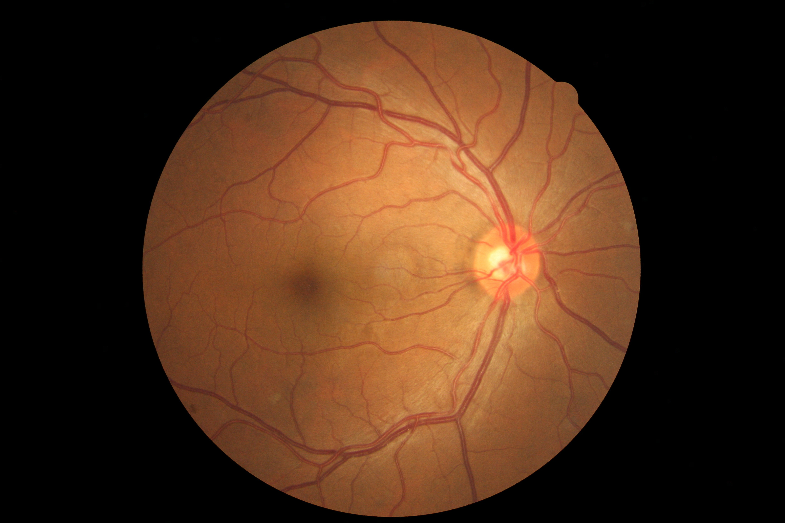
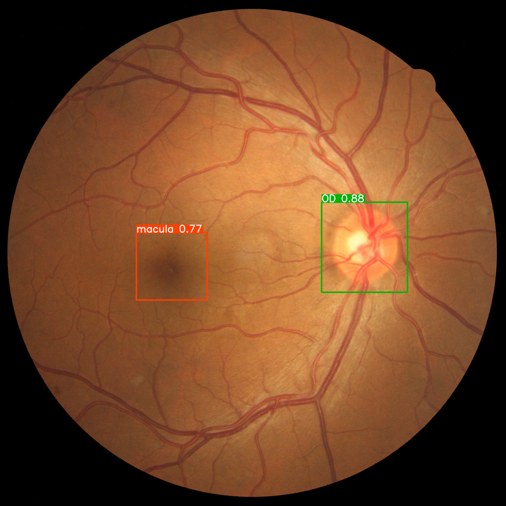

# Getting started

```bash
git clone https://github.com/alonso59/fundus_suitable.git  # clone
cd fundus_suitable
conda install pytorch torchvision cudatoolkit -c pytorch
pip install -r requirements.txt  # install
```

## Embedded repository YOLO V5 for retina detection FORK

```bash
cd src/
git clone https://github.com/alonso59/retina_det.git
```

## Prepare config file YAML

### Classification

```yaml
model_name: 'inceptionv3' # inceptionv3, resnet18, vgg13, swin_custom, swin_tiny, nat_mini, nat_custom
```

### Segmentation

```yaml
model_name: 'unet' #unet, unet_imagenet, swin_unet, swin_unet_custom
```

## Operation modes

### Training, Evaluation & Predict

```bash
cd ..
python src/main.py --stage class --mode train --config configs/classifier.yaml           
                           pre           eval          configs/segmenter.yaml                           
                           det           predict  
```

#### Dataset classification

    ├── datasets/
        classification/
            ├── train/
                ├── 0/
                ├── 1/
            ├── val/
                ├── 0/  
                ├── 1/
            ├── test/
                ├── 0/
                ├── 1/

#### Dataset segmentation

    ├── datasets/
        segmentation/
            ├── train/
                ├── Images/
                ├── Masks/
            ├── val/
                ├── Images/  
                ├── Masks/

#### Dataset detection

```bash
    python datasets/detection/perpare_files.py
```

    ├── datasets/
        detection/
            ├── images/
            ├── labels/
            ├── train.txt
            ├── val.txt

### Implementation

```bash
    python src/main.py --stage impl --source dataset/images/
                                             dataset/images/input.jpg
```

## Citation

```bibtex
@misc{pinedo,
      title={Fundus image quality assesment}, 
      author={Pinedo-Diaz},
      year={2022},
}
```
